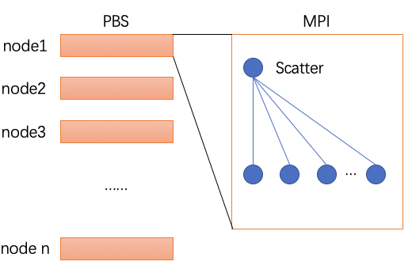
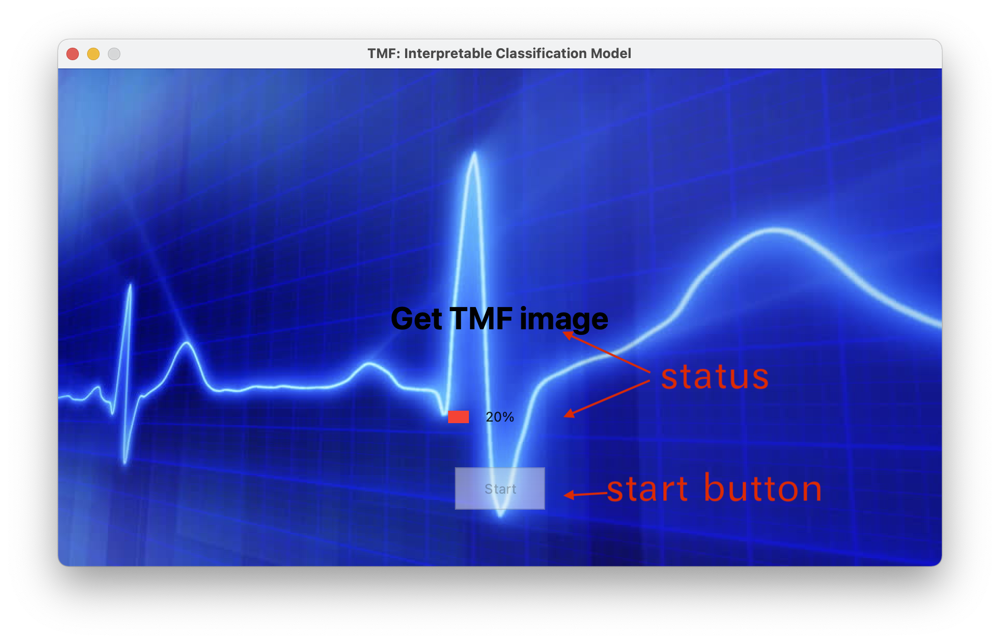
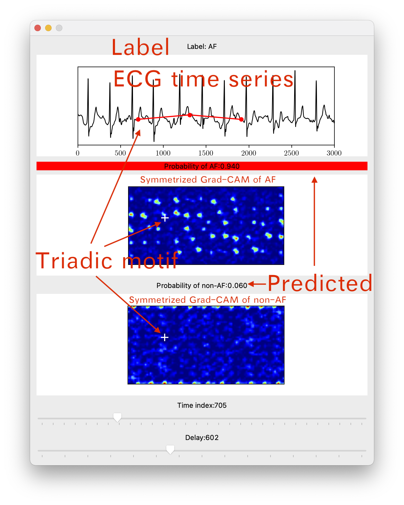
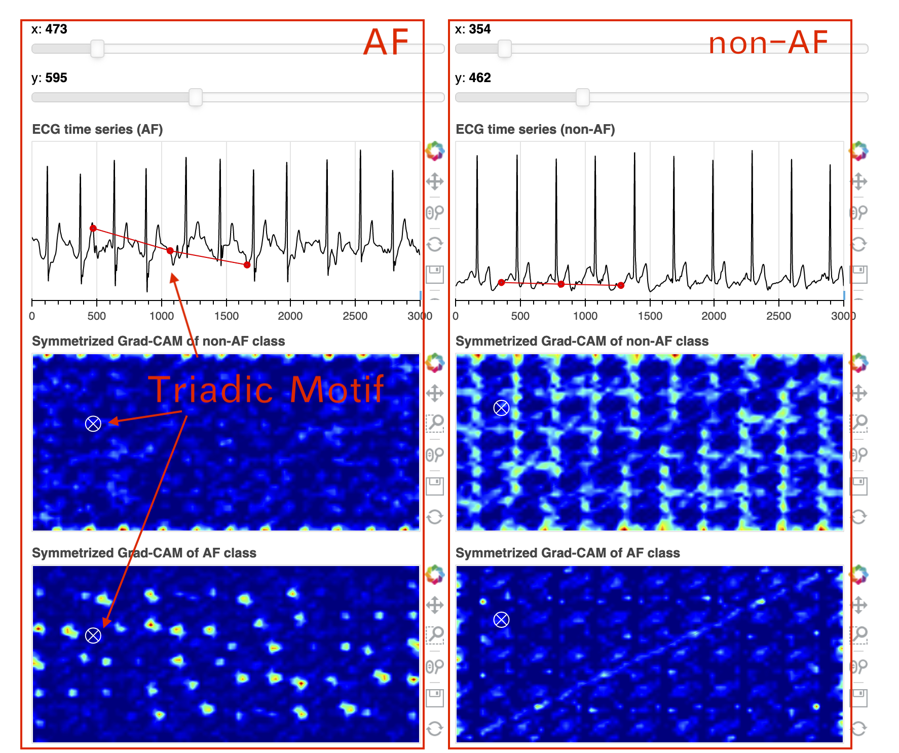

# Anomaly Detection in Time Series with Triadic Motif Fields and Application in Atrial Fibrillation ECG Classification

[](https://arxiv.org/abs/2012.04936) [](https://mybinder.org/v2/gh/ydup/bokeh/master?urlpath=/proxy/5006/bokeh-app) [](https://paperswithcode.com/sota/atrial-fibrillation-detection-on-physionet?p=anomaly-detection-in-time-series-with-triadic)

Author: [Yadong Zhang](https://github.com/ydup) and Xin Chen

Paper: [](https://arxiv.org/abs/2012.04936)

Online demo: [](https://mybinder.org/v2/gh/ydup/bokeh/master?urlpath=/proxy/5006/bokeh-app)

### Modules

Module | Path | Note | Default Settings
--- | --- | --- | ---
Basic | 1. [_lib_](lib/)<br>2. [_data_](data/)<br>3. [_model_](model/) | 1. Basic functions of the project.<br>2. Dataset processing.<br>3. Saved tail model weights. | 1. - <br> 2. no filter, z-normalization <br> 3. MLP model
Classification | 1. [_extractor_](extractor/)<br>2. [_classifier_](classifier/) | 1. Features extraction of TMF images based on transfer learning. <br> 2. Feature vectors classification to AF and non-AF probabilities. | 1. VGG16, map-reduce use ```10``` nodes and ```5``` mpisize.<br> 2. -
Evaluation | 1. [_length\_effect_](length_effect/) | 1. Evaluate the trained model on varying-length ECG signals. | 1. VGG16-MLP, map-reduce use ```10``` nodes and ```5``` mpisize.
App | 1. [_pyQT app_](app/)<br>2. [_bokeh app_](https://github.com/ydup/bokeh) | 1. Local app for classification and interpretation. <br> 2. Web server for interpretation. | VGG16-MLP

### Structures of Parallel Codes (mpi)

[_extractor_](extractor/) and [_length\_effect_](length_effect/) are parallelized on the linux clustering. (map-reduce)
+ ```.py```: main code.
+ ```.sh```: script for single submission to the pbs queue.
+ ```map*.py```: map the tasks to multi-nodes and mpi. <!---->
+ ```reduce*.py```: collect the results from the finished tasks.

### Guidelines of APP

Features | Classification | Visualization | Interactive | Remote | Local 
--- | --- | --- | --- |--- |--- 
[pyQT app](app/) | :heavy_check_mark: | :heavy_check_mark: | :heavy_check_mark: | :x: | :heavy_check_mark: 
[bokeh app](https://github.com/ydup/bokeh) | :x: (available in future) | :heavy_check_mark: | :heavy_check_mark: | :heavy_check_mark: | :heavy_check_mark: 

#### [pyQT app](app/)

1. Start page (click ```start```)
    + Start button
    + Process bar & status

2. Main page (from top to bottom)
    + Time series with label
    + Symmetrized Grad-CAM of AF and its predicted probability
    + Symmetrized Grad-CAM of non-AF and its predicted probability
    + Sliders of ```time index``` and ```delay``` to adjust the triadic time series motifs
        - Triad (red) in time series is corresponding to the cross (white) in two Symmetrized Grad-CAM images
        - The text with red background indicates the predicted type.

#### [bokeh app](https://github.com/ydup/bokeh)


### [Requirements](./requirements.txt)
Python 3.6:
```
matplotlib
mpi4py==3.0.3
numba==0.50.1
scikit-learn==0.23.0
scipy==1.5.2
tensorflow==1.14.0
opencv-python
tqdm
PyQT5
```

### Citation

Cite our work with:
```latex
@misc{zhang2020anomaly,
      title={Anomaly Detection in Time Series with Triadic Motif Fields and Application in Atrial Fibrillation ECG Classification}, 
      author={Yadong Zhang and Xin Chen},
      year={2020},
      eprint={2012.04936},
      archivePrefix={arXiv},
      primaryClass={cs.LG}
}
```
